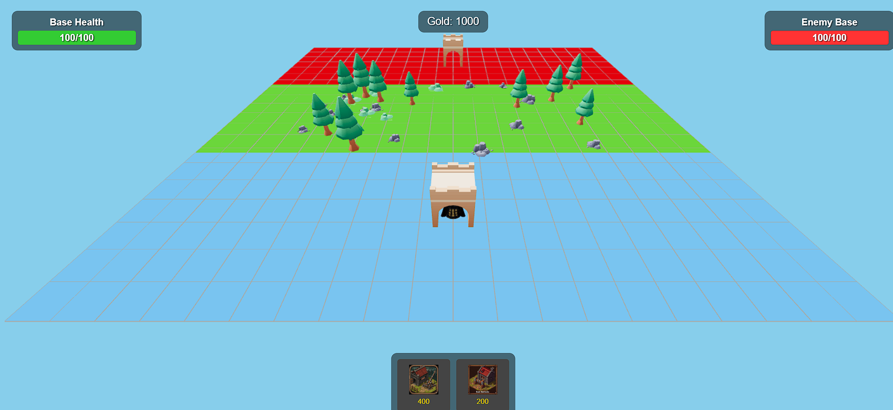

# Castle Fight

A 3D real-time strategy game where you build castles, train units, and defeat your enemy's base. Built with Three.js and modern web technologies.

  

## Game Overview

Castle Fight is a strategic battle game where you must:
- Build castles and towers on your side of the battlefield
- Train different types of military units
- Defend your base while attacking the enemy
- Manage your resources (gold) wisely
- Be the first to destroy the enemy's base!

## Features

- Build different structures (castles, towers)
- Train various military units (Rams, Ballistas)
- Strategic gameplay with resource management
- Beautiful 3D graphics powered by Three.js
- Immersive sound effects
- Responsive design that works on most devices

## Installation

### Prerequisites
- Modern web browser (Chrome, Firefox, Edge, or Safari)
- Node.js (optional, for local development)
- Git (optional, for cloning the repository)

### Quick Start
1. **Clone the repository** (or download as ZIP):
   ```bash
   git clone https://github.com/yourusername/castle-fight.git
   cd castle-fight
   ```

2. **Install dependencies** (if using Node.js):
   ```bash
   npm install
   ```

3. **Run a local server**:
   - **Option 1**: Using Node.js
     ```bash
     npm start
     ```
     Then open `http://localhost:3000` in your browser.
   
   - **Option 2**: Using Python (if you don't have Node.js)
     ```bash
     # Python 3
     python -m http.server
     
     # Python 2
     python -m SimpleHTTPServer
     ```
     Then open `http://localhost:8000` in your browser.

## How to Play

1. **Build Structures**:
   - Click the castle or tower button at the bottom of the screen
   - Click on your side of the battlefield to place the structure
   - Each structure costs gold (400 for castle, 200 for tower)

2. **Train Units**:
   - Castles automatically train Ballista units (ranged attackers)
   - Towers automatically train Ram units (melee attackers)
   - Units will automatically move toward the enemy base

3. **Win the Game**:
   - Destroy the enemy base before they destroy yours
   - Monitor both bases' health bars at the top of the screen

## Project Structure

```
castle-fight/
├── assets/               # Game assets (models, textures, sounds)
│   ├── icons/            # UI icons
│   └── models/           # 3D models
├── index.html            # Main HTML file
├── main.js               # Main game logic
└── README.md             # This file
```

## Contributing

Contributions are welcome! Please feel free to submit a Pull Request.

1. Fork the repository
2. Create your feature branch (`git checkout -b feature/AmazingFeature`)
3. Commit your changes (`git commit -m 'Add some AmazingFeature'`)
4. Push to the branch (`git push origin feature/AmazingFeature`)
5. Open a Pull Request

## License

This project is licensed under the MIT License - see the [LICENSE](LICENSE) file for details.

## Acknowledgments

- [Three.js](https://threejs.org/) for 3D rendering
- [GLTF Loader](https://threejs.org/docs/#examples/en/loaders/GLTFLoader) for 3D model loading
- [DRACO Loader](https://github.com/google/draco) for model compression

## Contact

amhvost@yahoo.com
