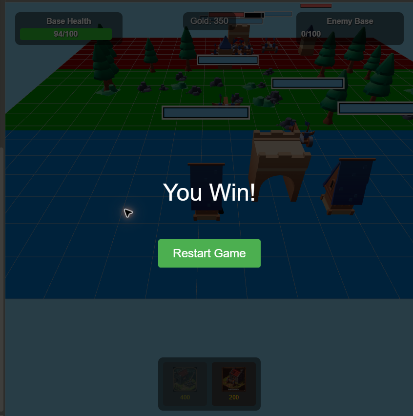

# Castle Fight

Castle Fight is a browser-based 3D real-time strategy prototype built with Three.js. The player develops the blue side of the battlefield, produces siege units, and tries to destroy the enemy base before the opposing army breaks through the player's defenses.



## Current State

The repository currently contains a playable single-player battle loop:

- A complete 3D battlefield divided into player, neutral, and enemy zones.
- A player-controlled worker that moves to the selected construction point.
- Castle and tower construction on the player's side of the map.
- Passive gold income and building-cost validation in the interface.
- Automatic production of player and enemy siege units.
- Autonomous unit movement toward the opposing base.
- Unit-versus-unit combat when opposing troops come within three grid cells.
- Health, damage, death, and target-reacquisition logic for combat units.
- World-space health bars above units, player buildings, enemy buildings, and both bases.
- Base attacks, victory/defeat detection, and a full match restart flow.
- Decorative GLB scenery including trees, rocks, terrain, walls, bridges, banners, and siege equipment.

## Gameplay

### Economy and construction

The player starts with 1,000 gold and receives 25 additional gold every five seconds. A castle costs 400 gold and a tower costs 200 gold. Construction buttons become unavailable automatically when the player cannot afford the selected structure.

After selecting a structure, click a valid point in the blue zone. The worker walks to that point and places the building when it arrives.

### Unit production

Buildings automatically produce units:

| Building | Unit | Production interval |
| --- | --- | ---: |
| Castle | Ballista | 5 seconds |
| Tower | Siege ram | 10 seconds |

Enemy barracks are created automatically and produce their own rams and ballistas. Enemy production is intentionally slower than the equivalent player production.

### Combat

Units normally advance toward the opposing base. When a hostile unit enters a radius of three grid cells, the unit:

1. Stops advancing toward the base.
2. Faces the nearest enemy.
3. Attacks once per second.
4. Updates the target's world-space health bar after every hit.
5. Removes the defeated unit and resumes its original advance.

Current unit balance:

| Unit | Health | Damage per attack | Movement speed |
| --- | ---: | ---: | ---: |
| Siege ram | 45 | 2 | 0.05 |
| Ballista | 65 | 10 | 0.03 |

Player units use blue health bars, while enemy units use red health bars. A bar changes to a critical red state when health falls below 35%.

### Buildings and bases

| Object | Health |
| --- | ---: |
| Tower | 140 |
| Castle | 200 |
| Main base | 100 |

Units that reach the enemy base attack it once per second. Destroying the enemy base displays the victory screen; losing the player base displays the game-over screen. The **Restart Game** button clears spawned units and buildings, resets health and gold, and starts a fresh match.

## Controls

- Click **Castle** or **Tower** to select the next building type.
- Click inside the blue player zone to order the worker to construct it.
- Unit production, movement, target selection, and combat are automatic.
- Use **Restart Game** after a battle ends to reset the match.

## Running Locally

### Requirements

- Node.js 18 or newer.
- A modern browser with WebGL support.
- An internet connection while playing. Three.js modules and the Draco decoder are currently loaded from public CDNs.

### Installation

```bash
git clone https://github.com/amhvpste/cf-client-test.git
cd cf-client-test
npm install
npm start
```

Open [http://localhost:3000](http://localhost:3000) in a browser.

The local server disables caching, which makes it easier to reload and verify gameplay changes during development.

## Technology

- Three.js for rendering and scene management.
- GLTFLoader for loading GLB models.
- DRACOLoader for compressed geometry support.
- JavaScript ES modules and browser import maps.
- `http-server` for local development.

No framework, bundler, backend, account system, or database is currently required.

## Project Structure

```text
cf-client-test/
|-- assets/
|   |-- icons/              # Construction menu icons
|   |-- models/             # Units, structures, terrain, and scenery
|   `-- screenshots/        # README and gameplay screenshots
|-- index.html              # Page markup, UI, and Three.js import map
|-- main.js                 # Scene setup, economy, spawning, movement, and combat
|-- package.json            # Local development commands and dependencies
`-- README.md               # Project documentation
```

## Known Limitations

- The game is a prototype and does not currently save progress.
- Unit movement does not yet use pathfinding or obstacle avoidance.
- Buildings display health but units currently focus on enemy troops and the opposing main base.
- Combat uses simple distance checks and fixed one-second attack intervals.
- Three.js and Draco runtime files are not yet bundled for offline play.
- Automated gameplay tests are not yet included.

## License

No separate license file is currently included in this repository. The package metadata currently declares ISC.

## Acknowledgments

- [Three.js](https://threejs.org/) for 3D rendering.
- [GLTFLoader](https://threejs.org/docs/#examples/en/loaders/GLTFLoader) for model loading.
- [DRACOLoader](https://threejs.org/docs/#examples/en/loaders/DRACOLoader) for Draco-compressed assets.

## Contact

amhvost@yahoo.com
